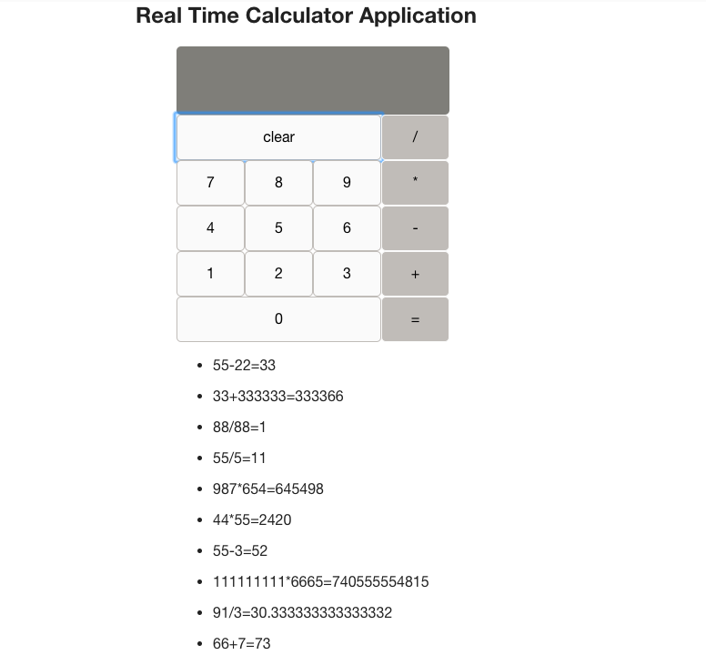

# Real Time Calculator

This is a realtime calculator application where users are updated automatically with other users calculations.  The last 10 calculations are shown on the page.

[Click Here](https://boiling-woodland-78022.herokuapp.com/#/) for a link to the live demo hosted on Heroku.

## Built With

- MongoDB
- Express
- AngularJS 
- Node.js
- socket.io

## Getting Started

These instructions will get you a copy of the project up and running on your local machine for development and testing purposes. 

### Prerequisites

- [Node.js](https://nodejs.org/en/)
- [Mongo](https://www.mongodb.com/download-center?jmp=tutorials&_ga=2.157987642.1691954874.1515639811-1798030591.1515639811#enterprise)
- Start Mongo and make sure it is up and running.

### Installing

Steps to get the development environment running.

1. Download this project.
2. `npm install`
3. `npm start`

## Screen Shot

### Completed Features

High level list of items completed.

- [x] Real time updates of calculations. 
- [x] Last 10 calculations are shown.
- [x] Basic calculator functions of adding, subtracting, multiplying and dividing.

## Authors

* Marta Jopp
